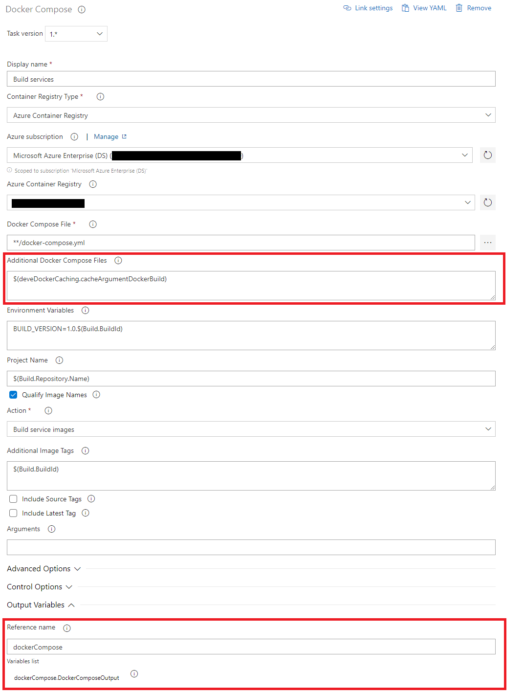

# DeveDockerCaching

This task can be used to cache layers during a docker build. It works for both docker builds and docker compose.

The way it works is as follows:

Let's say we have the following image:
`coolregistry.azurecr.io/coolimage-staging`

** 1. Pull Cached Layers (will be skipped the first time) **
During first build upload all layers as cache (e.g. coolregistry.azurecr.io/coolimage-staging:0 and coolregistry.azurecr.io/coolimage-staging:1)

** 2. docker (-compose) build **
Execute the docker-compose build using the normal docker (-compose) tasks using the output from the DeveDockerCaching task

** 3. Push Cached Layers **
After the build is completed, DeveDockerCaching will determine what layers need to be cached and push these as ....-staging:(0...n) to the container registry

## Setup in docker-compose caching

To be able to configure this you need 3 tasks

1. DeveDockerCaching - dockerComposePullCache
1. DockerCompose - build
1. DeveDockerCaching - dockerComposePushCache

### docker-compose classic pipelines

