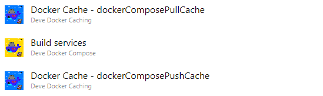
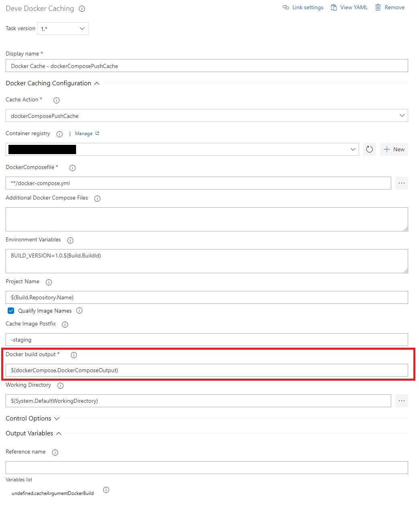
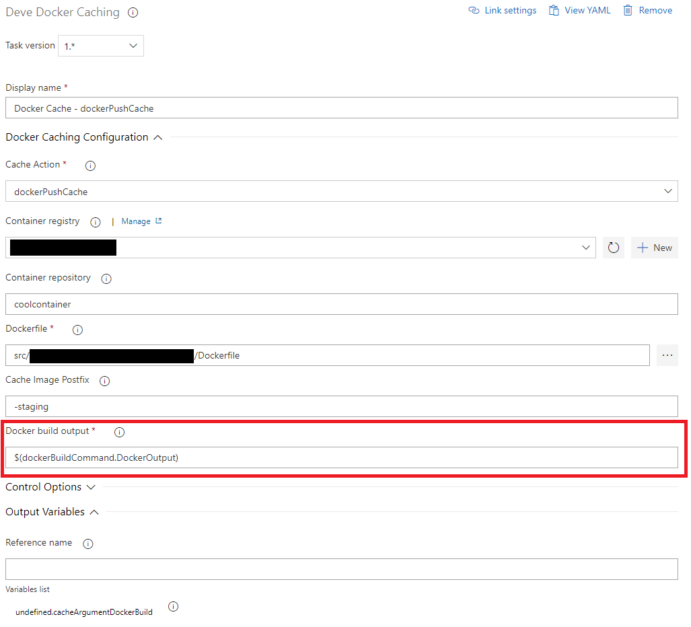

# DeveDockerCaching

This task can be used to cache layers during a docker build. It works for both docker builds and docker compose.

The way it works is as follows:

Let's say we have the following image:
`coolregistry.azurecr.io/coolimage-staging`

**1. Pull Cached Layers (will be skipped the first time)**

During first build upload all layers as cache (e.g. coolregistry.azurecr.io/coolimage-staging:0 and coolregistry.azurecr.io/coolimage-staging:1)

**2. docker (-compose) build**

Execute the docker-compose build using the normal docker (-compose) tasks using the output from the DeveDockerCaching task

**3. Push Cached Layers**

After the build is completed, DeveDockerCaching will determine what layers need to be cached and push these as ....-staging:(0...n) to the container registry

## Setup caching with docker-compose

To be able to configure this you need 3 tasks

1. DeveDockerCaching - dockerComposePullCache
1. DockerCompose - build
1. DeveDockerCaching - dockerComposePushCache



**DeveDockerCaching - dockerComposePullCache**

1. Make sure the variables are configured exactly the same as the docker-compose build task.
1. Make sure the output is stored in a variable which should be provided to the docker-compose build task in the "additional docker compose files".


```
- task: DeveDockerCaching@1
  name: 'deveDockerCaching'
  displayName: 'Docker Cache - dockerComposePullCache'
  inputs:
    action: dockerComposePullCache
    containerRegistry: coolregistry
```

**DockerCompose - build**

1. Make sure the `Additional Docker Compose Files` includes the output from the `DeveDockerCaching - dockerComposePullCache` task.
1. Set the output variable of the docker-compose build task to something. `DeveDockerCaching - dockerComposePushCache` needs this to determine what docker images where made.


```
- task: DevedseDockerCompose@1
  name: 'dockerCompose'
  displayName: 'DockerCompose - Build services'
  inputs:
    azureSubscription: 'Microsoft Azure Enterprise (/**************/)'
    azureContainerRegistry: '{"loginServer":"coolregistry.azurecr.io", "id" : "/subscriptions/**************/resourceGroups/coolregistryresources/providers/Microsoft.ContainerRegistry/registries/coolregistry"}'
    additionalDockerComposeFiles: '$(deveDockerCaching.cacheArgumentDockerBuild)'
    action: 'Build services'
    additionalImageTags: '$(Build.BuildId)'
```

**DeveDockerCaching - dockerComposePushCache**

1. Make sure the variables are configured exactly the same as the docker-compose build task.
1. Set the `Docker build output` variable to the output variable from the `DockerCompose - build` task.




```
- task: DeveDockerCaching@1
  displayName: 'Docker Cache - dockerComposePushCache'
  inputs:
    action: dockerComposePushCache
    containerRegistry: coolregistry
    dockerBuildOutput: '$(dockerCompose.DockerComposeOutput)'
```

## Setup caching with docker

To be able to configure this you need 4 tasks (docker build and docker push should be separated)

1. DeveDockerCaching - dockerPullCache
1. Docker - build
1. Docker - push
1. DeveDockerCaching - dockerPushCache


**DeveDockerCaching - dockerPullCache**

1. Make sure the variables are configured exactly the same as the docker build task.
1. Make sure the output is stored in a variable which should be provided to the docker build task in the "arguments".


```
- task: DeveDockerCaching@1
  name: deveDockerCaching
  inputs:
    action: 'dockerPullCache'
    containerRegistry: 'coolregistry'
    repository: 'coolcontainer'
    Dockerfile: '**/Dockerfile'
```

**Docker - build**

1. Make sure the `Arguments` includes the output from the `DeveDockerCaching - dockerPullCache` task.
1. Set the output variable of the docker-compose build task to something. `DeveDockerCaching - dockerPushCache` needs this to determine what docker images where made.


```
- task: Docker@2
  name: dockerBuildCommand
  displayName: 'Docker - Build'
  inputs:
    containerRegistry: 'coolregistry'
    repository: 'coolcontainer'
    command: 'build'
    Dockerfile: 'src/DocumentMining/DocumentMining.API/Dockerfile'
    buildContext: 'src/DocumentMining'
    arguments: '$(deveDockerCaching.cacheArgumentDockerBuild)'
```

**Docker - push**

1. This task does not need changes

```
- task: Docker@2
  displayName: 'Docker - Push'
  inputs:
    containerRegistry: coolregistry
    repository: coolcontainer
    command: push
```

**DeveDockerCaching - dockerPushCache**

1. Make sure the variables are configured exactly the same as the docker-compose build task.
1. Set the `Docker build output` variable to the output variable from the `Docker - build` task.



```
- task: DeveDockerCaching@1
  inputs:
    action: 'dockerPushCache'
    containerRegistry: 'coolregistry'
    repository: 'coolcontainer'
    Dockerfile: '**/Dockerfile'
    dockerBuildOutput: '$(dockerBuildCommand.DockerOutput)'
```